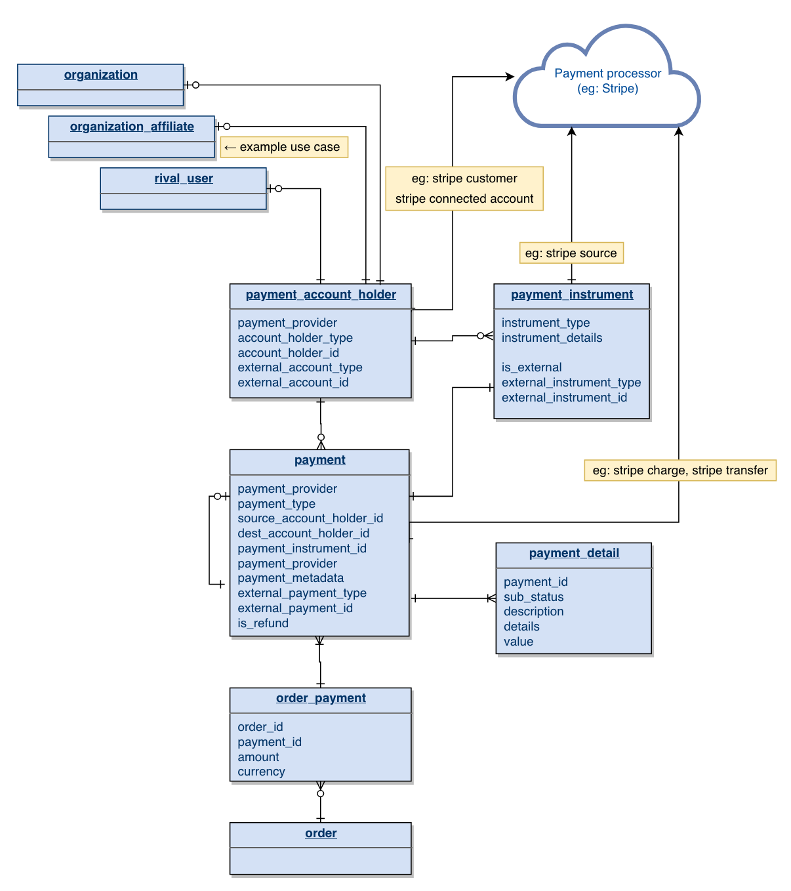
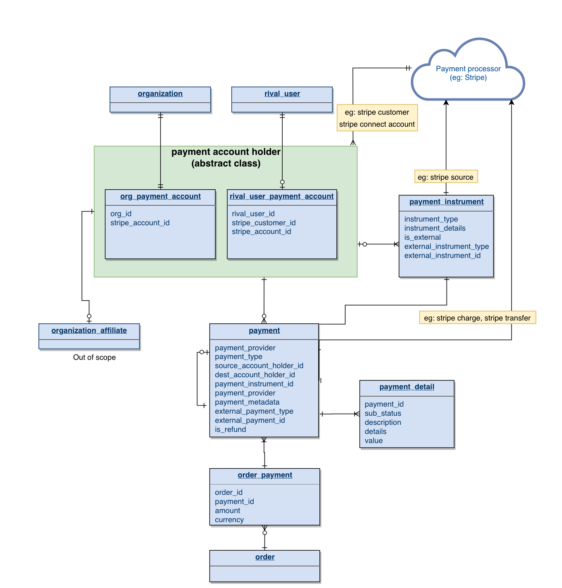
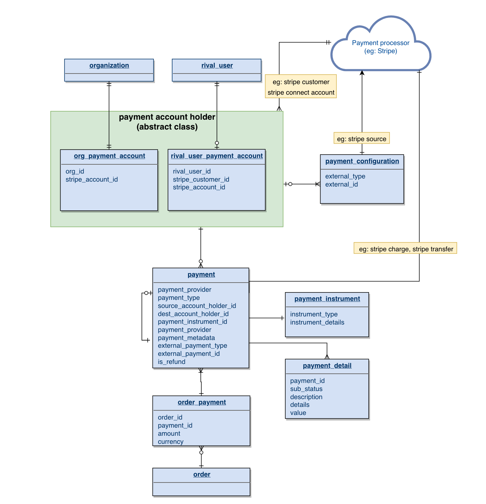

# Approaches: Payments Account Holders

## Approach One

## Approach 2

## Approach 3

**Notes on the above**

* Borrows from the first approach with independent rival user / organization payment account holder tables
* Creates a distinction between:
    * payment configuration: This is always tied to both a payment account holder and an external payment)
    * payment instrument: This is always tied to a payment, and describes the method used for the payment. This could be cash, check, or for digital payment methods, a snapshot of a payment configuration

## Some context...

* For a given payment scenario, the payer/payee is variable - this influences which Stripe API capability we use to transfer funds.
    * The payer could be a rival user, and the payee an Org. In this case, we would need to issue a **Stripe charge** as a payment.
    * The payer and payee could both be stripe connect accounts. In this case, we would issue a **Stripe transfer.**
* We represent payers/payees as **payment account holders** in our system. We will need to be flexible enough to ensure a transfer of funds is executed correctly given an arbitrary pair of payment account holders

## Key Differences

* The second approach: 
    * Breaks out the payment account holder table based on the owner of the account
    * Suggests an abstract class that wraps API behaviors that are variable based on the payment account holder type
* The first approach:
    * Keeps payment account holders consolidated in a single table
    * Like the second approach, this approach leaves room for wrapping API behaviors
* The Third apprach:
    * Borrows from the first with independent rival user / organization payment account holder tables
    * Creates a distinction between:
        * payment configuration: This is always tied to both a payment account holder and an external payment)
        * payment instrument: This is always tied to a payment, and describes the method used for the payment. This could be cash, check, or for digital payment methods, a snapshot of a payment configuration

