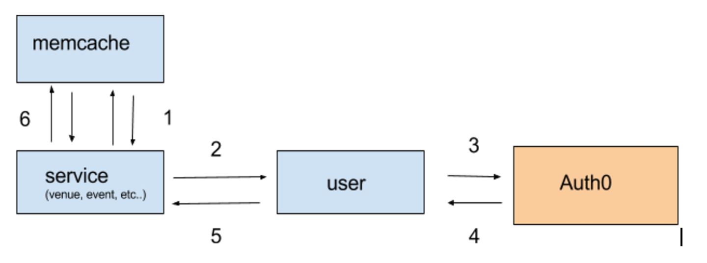

# Rival / Auth0 Integration

**OVERVIEW**

Auth0 is a provider of authentication and authorization services. They have an offering of authentication workflows to fit the needs of a variety of use cases.

At Rival we use the [Resource Owner Password](https://auth0.com/docs/api-auth/tutorials/password-grant) authentication flow. In this flow the end-user is asked to fill in credentials (username/password) using an interactive form. This information is later on sent to the Client and exchanged with an Authorization Server for a short lived access token. This token is used for authentication on subsequent api requests.

### OAuth 2.0 terminology

* **Resource Owner**: the entity that can grant access to a protected resource. Typically this is the end-user.
* **Client**: an application requesting access to a protected resource on behalf of the Resource Owner.
* **Resource Server**: the server hosting the protected resources. This is the API you want to access.
* **Authorization Server**: the server that authenticates the Resource Owner, and issues access tokens after getting proper authorization. In this case, Auth0.
* **User Agent**: the agent used by the Resource Owner to interact with the Client, for example a browser or a native application.

_Architecture_

**Example Flow**:

1. (Venue) service receives api request and checks for a token in the Authorization header. If there is a token it will see if it exists in memcache. All tokens stored in memcache are valid.
2. If the token exists in memcache the request is fulfilled. Otherwise a request will be made to the user service to validate the token.
3. User token service receives request to authorize token. It passes the token to auth0 for authorization.
4. Auth0 authorization succeeds
5. user token service succeeds
6. (Venue) service will place the validated token into the cache, and complete the request

**Multiple Environments:**
In order to [support multiple environments](https://auth0.com/docs/dev-lifecycle/setting-up-env), we have namespaced auth0 accounts for each environment ([https://rival-dev.auth0.com](https://rival-dev.auth0.com/), [https://rival-int.auth0.com](https://rival-dev.auth0.com/), etc). Each environment will in turn authenticate against these endpoints as well perform standard user management operations.

# Environment Setup

There are a few setups tasks that are required in order to successfully connect with the auth0 api.

Each environment account needs to complete the following set up from the auth0 web interface:

1. Account Settings >  Default Directory = Username-Password-Authentication
2. Create a client: 
    1. Clients > Create Client
    2. name: rival-(dev|int|etc) 
3. Clients > rival-(dev|int|etc) > Token Endpoint Authentication Method > Post
4. Clients > rival-(dev|int|etc)  > (inside Advanced settings in Client → settings) Grant Types > Ensure “password” and “client_credentials” are set
5. Finally the management api needs to authorize the client for user operations.
    1. Apis > Auth0 Management Api > Non-Interactive clients > rival-{env}. Select AUTHORIZE and choose CRUD operations for user scopes and save again

**Refresh Token Flow**
Access tokens are short lived - meaning there is a chance they will expire in the middle of user session. We have a process for requesting new access
The flow looks like this:

* User logs in. On authentication we cache away the refresh token, the key being the access token.
* User makes first api-request. Our auth decorator uses the access token as a key to grab from cache, and appends additional user/permission info under that key, sets the current user, etc.
* Later the front-end passes its access token for a new one via the refresh endpoint. We use that access token to grab the refresh token from cache, and go ahead requesting/delivering a new access token for the client. We also cache the refresh again under this new key. This way we get the same behavior on the next api request. The auth decorator will look at the *new* access token, and again append the user/permission info, current user, etc.

One important aspect here is that we keep the refresh token on the backend at all times. Refresh tokens are long lived and dangerous if sent out of the system. Auth0 has some good [docs](https://auth0.com/learn/refresh-tokens/) on that.
