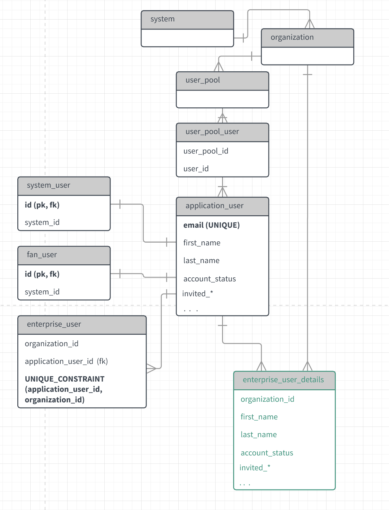
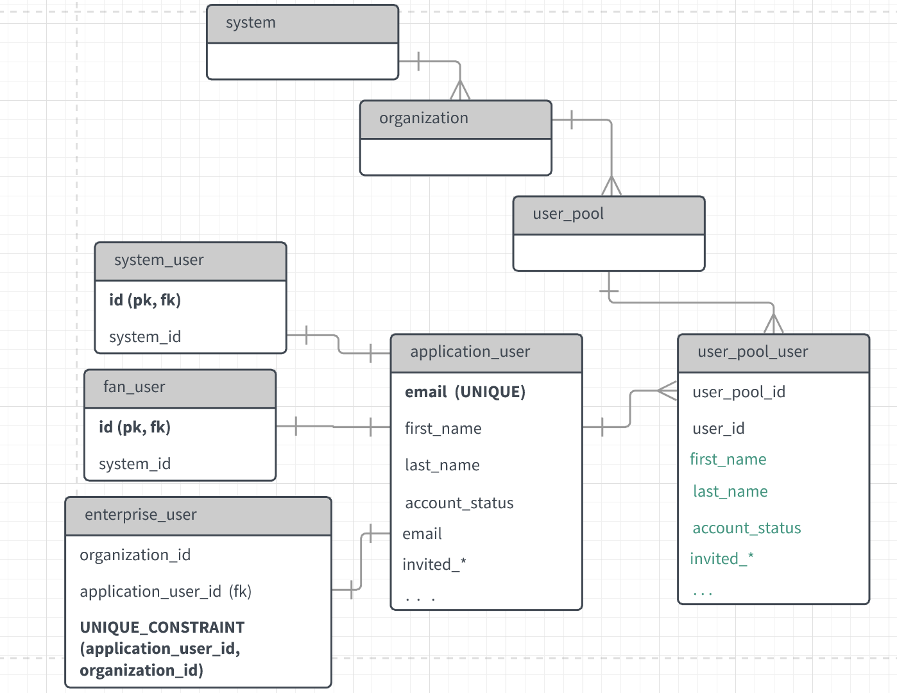
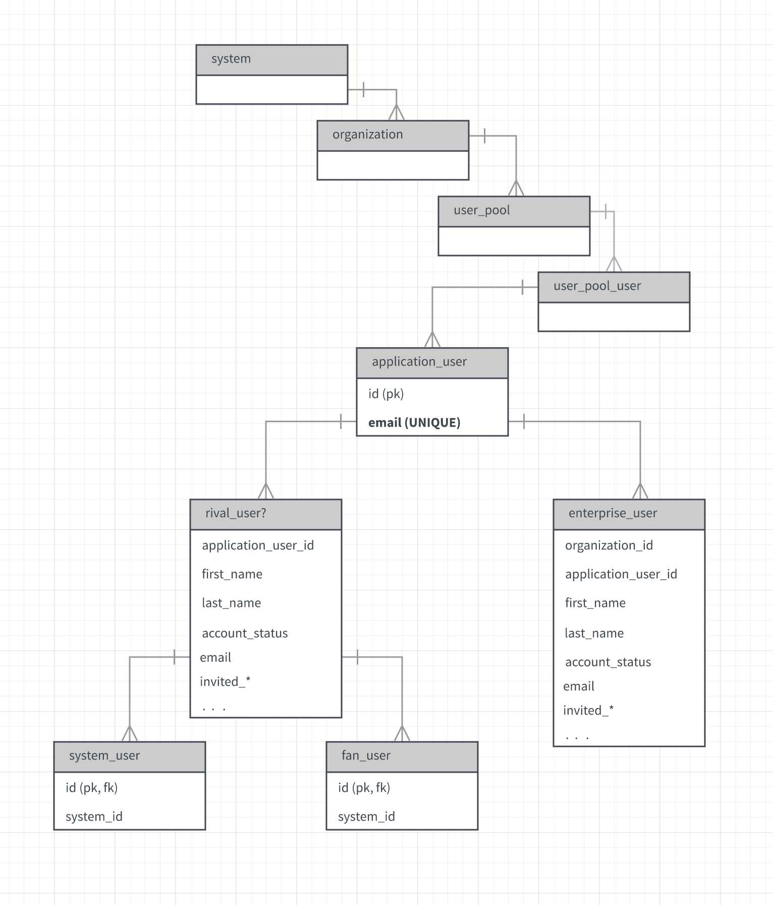

## [DEPRECATED] Cuyahoga planning - Multi tenant users

**GOALS**

* Achieve a model that enables a single enterprise user to relate to multiple orgs.

* Handling enterprise user creation with the same email address. Each organization needs their own “view” of a particular enterprise user. (not meant to be confused with a SQL view, but rather an independent record)  For example: org A and org B may both create a user with the email [bob@domain.com](mailto:bob@domain.com). They may make updates to the first name/last name/etc  which are not seen by and are independent to other organizations. 
* Linking different emails to the same user identity (post-cuyahoga)
    

### Existing Setup

(non-essential attributes have been omitted for clarity)

Enterprise / customer / and system users relate to the application user table through **join table inheritance**. The main pain point here is the **unique constraint** on **email**, preventing subsequent orgs from creating a user who's email already exists in the system. The moment a second org attempts to add a user with an existing email - we will throw uniqueness errors.  

**Proposal One**

The main idea here is to let the user pool user record be the orgs** “**view” of that enterprise user. Note that we retain the same attributes on the application user table, this ensures that the api interactions for system and customer users don't change. Also the enterprise user table can no longer maintain a id (pk/fk) pair - subsequent creates on the same email will append a new record in the enterprise_user table, but will map back to the same application user that matches the email.

The pro here is that we achieve an org specific view of a particular enterprise user. The users state model for a particular org will live on the user pool user record, and because these records are org scoped, they are particular to a specific org.

There cons here begin with the awkwardness of having attributes defined on the user pool users table. Ideally this bridge table would have a single responsibility (bridging users with user pools) - but this set up gives it a much bigger job than that. It becomes harder to reason about where the true source of information is. We also complicate our API. For example,  **GET** **/enterprise_user **should return a list of enterprise users. Under this set up, we would need repackage enterprise user objects based what we see in the user_pool_user table. This would involve service method overrides for pretty much every crud action.

**Proposal Two**

The basic idea here is to break out org specific details into its own table, leaving the user pool user table as is. 

NOTE: In the above model there is a specific reason why the enterprise user details are separated out into its own table, and not redefined on the enterprise_user table. The join table inheritance pattern between system_user/customer_user/enterprise_user → application_user enforces that any attributes shared columns between child / parent models are mirrored. 

Similarly to the last example, the pro here is that multiple orgs can add a user with the same email address. There exists a single application user record behind that user. Subsequent creates on the same email will create a new **enterprise_user **and **enterprise_user_details** record, but will map back to the same application user. Each org can fill in their own details for a user via the **enterprise_user_details** record.

The con here is again reconciling the way data flows through our api. Supposing our clients go through **/enterprise_user **to manage enterprise users, our EnterpriseUserService would need to become a broker of information that lives in the **enterprise_user_details** table.

**Proposal Three**

(This is still a bare bones idea which that came out of a conversation between Matt and myself.)

The main idea here is to strip down the application user table to be a bare bones identity store. Enterprise users are broken out into their own table, with all of the standard attributes defined. This table relates to application user through join table inheritance. If we detect an email match on a create, we append a new record onto the enterprise user table, and maintain a mapping back to the application user. 

For system and customer users, their standard attributes are defined on a shared parent table **[company]_user **(names suggestions are highly welcomed here). They would relate to the parent through join table inheritance.

One key advantage here is that a single** application_user** identity can now be both an enterprise, customer, and system user - this is something not possible with the previous two set ups. Also the join table inheritance would allow us to keep natural service / api interactions behind the **/system_user** **/customer_user** endpoints, as their parent **[company]_user** would act as a hidden table.

Note: The application_user > [company]_user > system_user join table inheritance hierarchy might not be supported by sql alchemy, as join table inheritance might only work one level deep.

A slight disadvantage here is the redefinition of standard attributes on both **enterprise_user**, and **[company]_user.**
