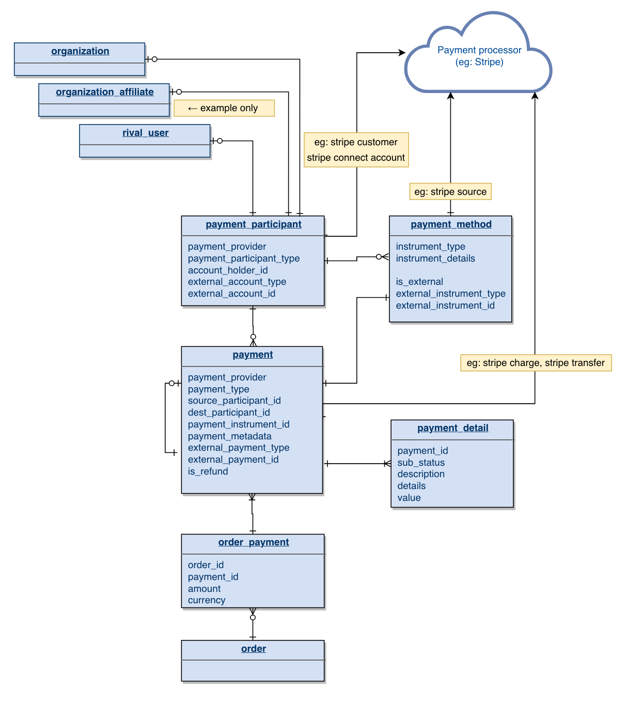
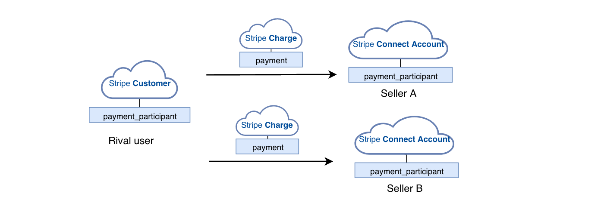

# Payment Participants

This doc is a continuation of the modeling from:

* [General Payments Model and Attested Payments](https://10e.quip.com/UuKoAjYgHusL)
* [Supporting payments with Stripe](https://10e.quip.com/AbneAJpwztUG)

## Goal

Introduce a concept to our payment model that would enable arbitrary flows of funds between participants on a payment processing platform.

## Model 

**Feel free to make live edits. **Existing fields have been omitted for clarity.****

## Some things to note:

* Arbitrary entities in the system can be payment participants
    * This at least leaves the door open for P2P, B2B payments
    * Rival will restrict what entities in the system are payment participants
    * All payments will record the **source_participant_id** and **dest_participant_id** fields
* The existing aspects of the payment model, like the state model, and the modeling around refunds, attested payments, chargebacks can remain the same

## Use Cases

### **1. Traditional order payment**

Rival user makes a payment on an order with Org A

### **2. Multi-seller PAYMENT (Option ONE)**

* Rival user makes a payment on an order that has multiple sellers: Seller A and Seller B
* More details from Stripe [here](https://stripe.com/docs/connect/charges-transfers)

### **3. Multi-seller PAYMENT (Option TWO)**

* Rival user makes a payment on an order that has multiple sellers: Seller A and Seller B
* More details from Stripe [here](https://stripe.com/docs/connect/charges-transfers)
* One difference here is that the purchaser sees a single charge for the order, to Rival, made on their bank account statement.

### **4. Org-to-Org payment**

Org A makes a payment to Org B

### **5. Peer to Peer Payment**

Rival user A makes a payment to Rival user B

### **6. Corporate ACCOUNT Payment**

* Rival users in Corporate Account A make a payment on an order
* The payment participant in this example would point to the organization's corporate account.

