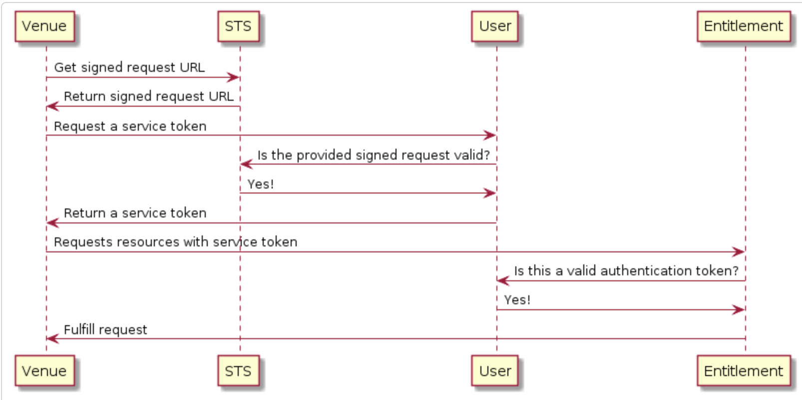
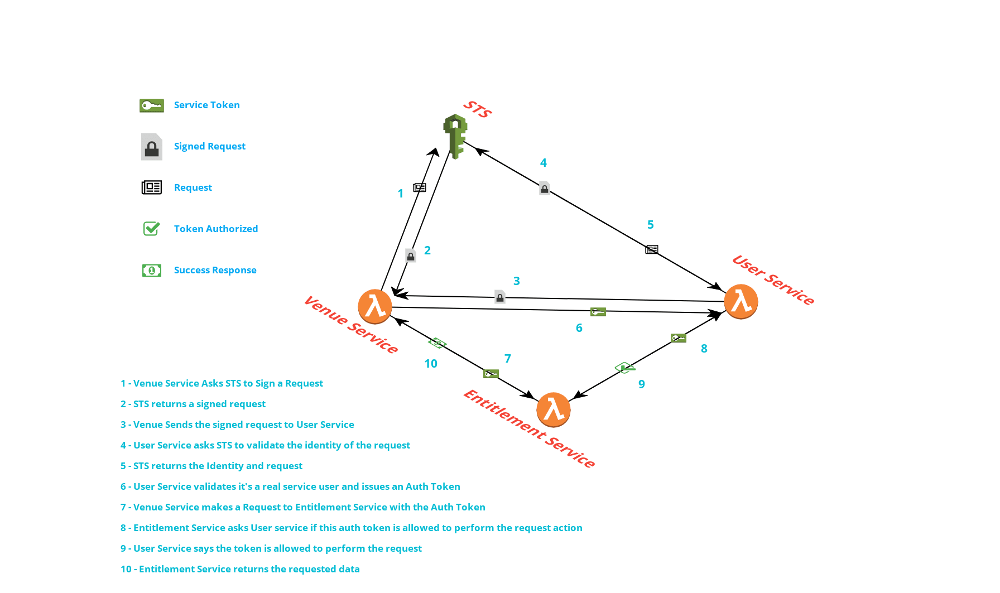

# Service tokens

Last edited: 23 July 2018
Status: Draft

## **Problem description**

Internal processes (service lambdas / cron tasks / etc) need the ability to communicate with our service api’s. Currently, our service api’s require an authentication token which is scoped to a real user, however in these contexts there is no user. As a result our internal processes have no way of fetching or modifying resources through our apis.

## **High level objectives**

* Establish a mechanism for trusted internal parties to obtain authentication tokens recognized by our service apis.
* Ensure an entry point exists for RBAC, meaning trusted internal processes can be scoped to permissions in our system.
* Ensure there are no security holes. Prevent untrusted parties from obtaining service tokens. Minimize the number of stored secrets in our system. 
* Constrain what services can obtain service tokens 
* Limit the actions that services can perform with their tokens

## **Solution**

User service will expose an endpoint which issues service tokens:

* Concretely these will be signed JSON web tokens (JWTs):
*  They will enter our authentication layer in the same way as a traditional token. They can still be thought of as authentication tokens.
* When our auth layer detects a service token, it is validated against a stored secret.
* The tokens will be given an expiration based on expected usage.

As a required param, user service will accept and validate a special URL signed by AWS. This URL establishes the identity of the caller and must be validated before a service token can be issued:

*  This is commonly referred to as a signed request URL. [AWS Docs](https://docs.aws.amazon.com/AmazonS3/latest/API/sig-v4-authenticating-requests.html)
*  It will be passed on the body over SSL
* Should correspond to the STS [get_caller_identity()](https://docs.aws.amazon.com/STS/latest/APIReference/API_GetCallerIdentity.html) operation. This returns the identifying information of the resource which generated the URL.
* For additional security, the signed request can be given an expiration. We can establish this value in a config. 
* Boto exposes a method [get_presigned_url()](https://boto3.readthedocs.io/en/latest/reference/services/sts.html#STS.Client.generate_presigned_url)that will generate this URL on behalf of the caller. There is an expectation that the caller is some resource in our system that has AWS credentials.

User service will perform several checks on this URL:

1. Validate the URL properly formatted, ie: It is the expected STS call
2. Issue a GET request using the signed request URL, and validate the response is a success
    1. This validates the identity, and that the data wasn't tampered with, and it's within 15 mins of creating the signed request. More Details [here](https://docs.aws.amazon.com/AmazonS3/latest/API/sig-v4-authenticating-requests.html)
3. If success, extract additional identifying information, including account id / assumed role / resource.
4. Check the resource is in the same account

If all checks succeed, user-service will:

1. Ensure a service user exists for the requesting resource. 
    1. This user will be persisted to our service user table
    2. The user will have a similar shape to other user types, and will end up being cached in the current user context along with their permissions on authentication.
    3. The email used for this user will be derived from the assumed role + resource name of the requesting resource. 
2. If RBAC configuration exists for this user, ensure the created user is given permissions
3. Return the service token

## Other Considerations

### **Making things easy for our consumers**

We will want to abstract away the whole process of obtaining a service token from our library  consumers. We can wrap the whole token fetching process in a shared method `get_service_token()`, and expose that through a common library like `rival-authentication`. Any rival process with an AWS context can import this function to obtain a service token.

### **Scoping things down**

Currently the only use case we have for service tokens is the computed entity case. I think we should maintain a whitelist of permitted resource identities, in order to prevent unexpected parts of our system from requesting service tokens. In the future we might give assumed roles to contractors or third party services, so we wouldn't want to recognize service token requests for any IAM role in the account. This creates friction - since new resources which desire the ability to request service tokens will need to register themselves with the white list. This is something that can be configured out of band, by a developer. We might want to issue notifications for resources in our system that have requested service tokens, but haven't been whitelisted.

**EXAMPLE SEQUENCE DIAGRAM**

In the above example, venue service obtains an authentication token (service token), and uses it to hit the entitlement API. Venue will prepare a service token request by obtaining a signed request url from STS. It will then pass the signed request URL to user service. User service validates the URL, and returns the service token. The returned service token can be used in subsequent calls to entitlement service.

