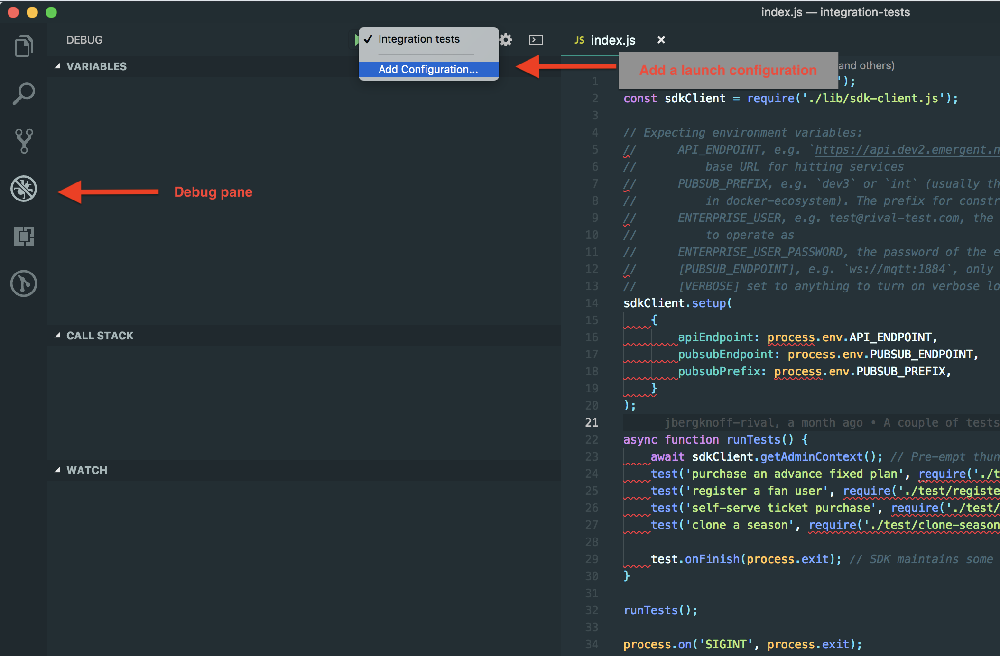
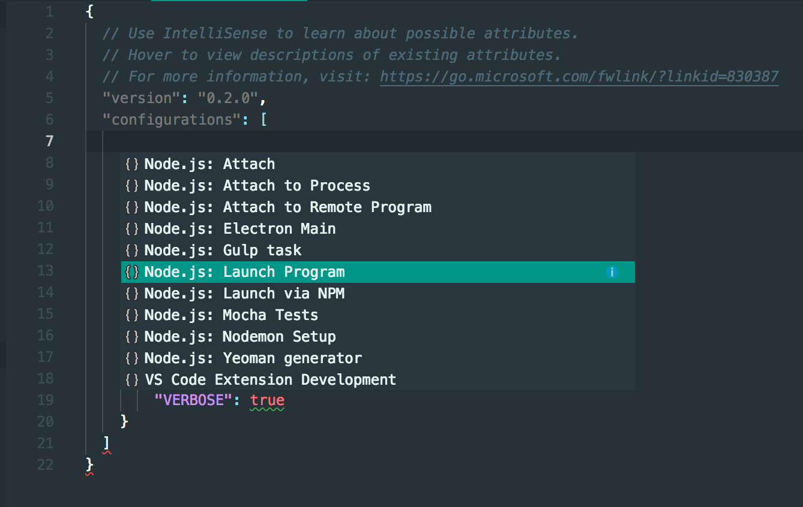
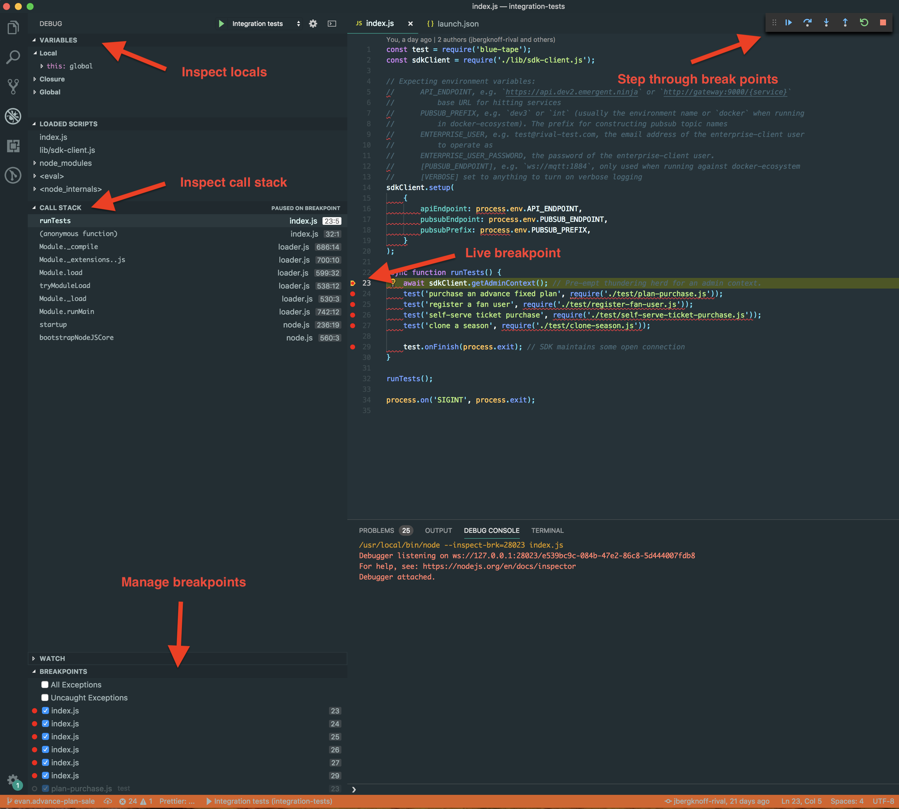

# Debugging integration tests with VSCode


Enter the debug pane, open the configuration dropdown as shown below, and select “**Add configuration**”


If you don't already have a **.****vscode **folder in your project root, this should create one for you

You will be prompted to select the type of configuration to be created. Choose **Launch program**


By this point, VSCode should have auto-populated a JSON file for you with some placeholder settings.

Go ahead and fill in the blanks using the following


```
{
  // Use IntelliSense to learn about possible attributes.
  // Hover to view descriptions of existing attributes.
  // For more information, visit: https://go.microsoft.com/fwlink/?linkid=830387
  "version": "0.2.0",
  "configurations": [
    {
      "type": "node",
      "request": "launch",
      "name": "Integration tests",
      "program": "${workspaceFolder}/index.js",
      "env": {
        "ENTERPRISE_USER": "test@[company]-test.com",
        "ENTERPRISE_USER_PASSWORD": "[company][customer]",
        "API_ENDPOINT": "http://gateway:9000/{service}",
        "PUBSUB_ENDPOINT": "ws://mqtt:1884",
        "PUBSUB_PREFIX": "docker",
        "VERBOSE": true
    }
  }
  ]
}
```


(Project repo can be found [here](https://github.com/10eTechnology/integration-tests))

With this configuration saved you should be ready to go. 

To start debugging, enter the Debug pane again, choose your saved configuration from the dropdown, and click the green play button

With the debugger running you should enter an interface like this:

And you should be on your merry way!
